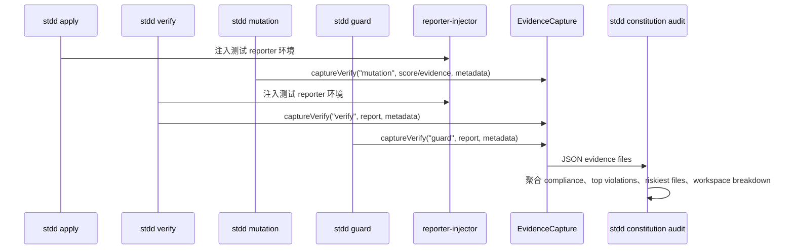

# STDD Copilot 系统架构

version: "2.6"
last_updated: "2026-05-26"

## 概述

STDD Copilot Ultra 基于 Skill Graph (技能图谱) 将 Spec-First 与 TDD 深度融合。包含 57 个 Skills、12 个 Agent 角色、9 篇 Constitution 条例、Hook Enforcement System，以及 88 个 CLI 命令和 88 个命令模板。

**架构边界**: CLI 负责产物生成、测试执行、mutation evidence、证据采集、质量门禁和工作区编排。真实 AI 自动编码、多 Agent runtime、contract/mock/factory 等仍由 Skill 和外部 AI 执行器承载。Quick mutation 是启发式 anti-fake-green 检查；真实 mutation 依赖项目安装并配置 Stryker。

**运行时模块**: `file-walker.js` (共享目录遍历)、`logger.js` (多级日志 + 轮转)、`security.js` (输入清理 + 密钥检测 + 路径安全)、`command-registry.js` (集中式命令定义)、`command-loader.js` (动态命令加载)、`types/index.js` (TypeScript/JSDoc 类型定义)、`session-progress.js` (实时进度追踪 + 断点续传)、`party-orchestrator.js` (多 Agent 编排器)、`cross-talk-analyzer.js` (Agent 交叉分析)、`persona-profiles.js` (角色画像系统)、`persona-memory.js` (角色持久记忆)。

**测试基线**: `npm run premerge`，覆盖 `npm audit --audit-level=high`、ESLint、文档契约测试和 Jest 回归测试。

---

## 系统架构图

```mermaid
graph TB
    subgraph UserLayer["用户层"]
        U[用户]
        CLI[CLI 命令行<br/>88 个命令]
        IDE[IDE 集成<br/>Claude Code / Cursor / Windsurf / Copilot]
    end

    subgraph SkillGraphEngine["Skill Graph 引擎"]
        VIS[Visualizer<br/>CLI visualize]
        ANA[Analyzer<br/>CLI analyze/recommend]
        SCHED[Scheduler<br/>调度引擎]
        TRACK[Tracker<br/>history/evidence]
        COND[Condition Engine<br/>条件引擎]
        PARA[Parallel Executor<br/>运行时模块]
        REC[Recommender<br/>CLI recommend]
        RUN[Graph Run CLI<br/>stdd graph run]
    end

    subgraph CoreSkills["核心 Skills (5 阶段)"]
        INIT[stdd-init<br/>初始化]
        PROP[stdd-propose<br/>需求提案]
        CLAR[stdd-clarify<br/>需求澄清]
        CONF[stdd-confirm<br/>需求确认]
        SPEC[stdd-spec<br/>生成规格]
    end

    subgraph DesignImpl["设计 + 实现"]
        PLAN[stdd-plan<br/>任务拆解]
        EXEC[stdd-execute<br/>TDD执行]
        DOC[stdd-final-doc<br/>生成文档]
        COMMIT[stdd-commit<br/>代码提交]
    end

    subgraph SDDSkills["SDD 增强"]
        API[stdd-api-spec]
        SCH[stdd-schema]
        CONT[stdd-contract]
        VAL[stdd-validate]
    end

    subgraph TDDSkills["TDD 增强"]
        OI[stdd-outside-in]
        MOCK[stdd-mock]
        FACT[stdd-factory]
        MUT[stdd-mutation]
    end

    subgraph AssistantSkills["辅助 Skills"]
        GUARD[stdd-guard]
        SUP[stdd-supervisor]
        CTX[stdd-context]
        ITER[stdd-iterate<br/>Plan-Execute-Reflect]
        MEM[stdd-memory]
        PAR[stdd-parallel]
        ROLE[stdd-roles<br/>12 Agent]
        MET[stdd-metrics]
        LRN[stdd-learn]
        PRP[stdd-prp]
    end

    subgraph NewSkills["新增 Skills"]
        TURBO[stdd-turbo]
        BRAIN[stdd-brainstorm]
        ISSUE[stdd-issue]
        CERT[stdd-certainty]
        CPLX[stdd-complexity]
        VISION[stdd-vision]
        UTEST[stdd-user-test]
        HELP[stdd-help]
    end

    subgraph Phase2to4["Phase 2-4: Builder / UI / Marketplace / Dashboard"]
        BUILDER[stdd-builder<br/>Agent/Workflow/Skill 工厂]
        UI[stdd-ui<br/>UI Generator + DESIGN.md Token]
        MODULES[stdd-modules<br/>社区模块市场]
        DASH[stdd-dashboard<br/>静态 HTML 项目健康仪表板]
        DOCS[stdd-docs<br/>文档站点生成器]
    end

    subgraph Phase2to4Adv["Phase 2-4: 智能 / 编排 / 画像"]
        PROFILE[stdd-profile<br/>规划深度自适应]
        PRFAQ[stdd-prfaq<br/>Amazon Working Backwards]
        CODEGRAPH[stdd-codegraph<br/>代码知识图谱]
        PARTY[Party Orchestrator<br/>多 Agent 编排器]
        XTALK[Cross-Talk Analyzer<br/>Agent 交叉分析]
        PERSONA[Persona System<br/>角色画像 + 持久记忆]
    end

    subgraph IDEAdapters["IDE 适配器"]
        CLAUDEADAPTER[Claude Code]
        CURSORADAPTER[Cursor]
        WINDSURFADAPTER[Windsurf]
        VSCODEADAPTER[VS Code Copilot]
        AUGMENTADAPTER[Augment / Gemini CLI / Codex]
    end

    subgraph Storage["存储层"]
        MEMORY[stdd/memory/]
        GRAPH[stdd/graph/]
        SPECS[stdd/specs/]
        CHANGES[stdd/changes/]
        CONFIG[stdd/config.yaml]
        TEMPLATES[stdd/templates/]
        REPORTS[stdd/reporters/]
        EVID[stdd/evidence/<br/>changes/*/evidence]
        WS[stdd/config.yaml<br/>workspace registry]
        BUILDERS[stdd/builders/<br/>自定义 Agent/Workflow/Skill]
        PERSONAS[stdd/personas/<br/>角色持久记忆]
        ITERATIONS[stdd/iterations/<br/>迭代循环记录]
        PRFAQDIR[stdd/prfaq/<br/>PRFAQ 工作文]
        UIDIR[stdd/ui/<br/>生成的前端代码]
    end

    subgraph Enforcement["执行保障"]
        CONSTITUTION[Constitution<br/>9 篇条例]
        HOOKS[Hook System<br/>Pre/Post ToolUse]
        WAIVERS[豁免机制<br/>waivers.yaml]
    end

    subgraph Workspace["Workspace / Monorepo"]
        WSLIST[workspace list]
        WSVAL[workspace validate]
        WSREP[workspace repair]
        WSSCOPE[--workspace scope]
    end

    subgraph EvidenceFlow["Evidence / Audit / Reporter / Coverage / Mutation"]
        REP[Reporter Injector]
        VER[verify evidence]
        GRD[guard evidence]
        MUTCLI[mutation evidence]
        AUD[audit aggregation]
        COV[coverage report-aware ratio]
    end

    U --> CLI
    U --> IDE
    CLI --> SkillGraphEngine
    IDE --> IDEAdapters
    IDEAdapters --> SkillGraphEngine

    INIT --> PROP --> CLAR --> CONF --> SPEC
    SPEC --> PLAN --> EXEC --> DOC --> COMMIT

    SPEC -.-> API
    SPEC -.-> SCH
    EXEC -.-> CONT
    EXEC -.-> VAL
    EXEC -.-> OI
    EXEC -.-> MOCK
    EXEC -.-> FACT
    EXEC -.-> MUT

    TURBO -.-> PROP
    BRAIN -.-> PROP
    ISSUE -.-> EXEC

    BUILDER -.-> TEMPLATES
    BUILDER -.-> MODULES
    UI -.-> UIDIR
    DASH -.-> EVID
    DOCS -.-> REPORTS
    PRFAQ -.-> PERSONA
    CODEGRAPH -.-> GRAPH
    PARTY --> XTALK
    PARTY -.-> ROLE
    PROFILE -.-> PLAN

    GUARD -.-> EXEC
    CONSTITUTION --> HOOKS --> GUARD
    HOOKS --> WAIVERS
    CLI --> Workspace
    Workspace --> WS
    WSSCOPE --> EXEC
    WSSCOPE --> VER
    EXEC --> REP --> EVID
    EXEC --> MUTCLI --> EVID
    VER --> EVID
    GUARD --> GRD --> EVID
    EVID --> AUD
    COV --> GUARD
    DASH --> AUD
```



---

## 核心组件说明

### Workflow & Governance (Runtime Engines)
| 模块 | 职责 | 能力 |
|---|---|---|
| **stdd runtime agent** | 多 Agent 状态机 (Party Mode) | 启动/推进/停止多 Agent 辩论，管理交互历史与收敛状态 |
| **stdd runtime sudo** | SudoLang 伪代码解析引擎 | 将 Sudo 伪代码解析为 STDD 结构化产物 (Spec/Design/API) |
| `stdd archive` | Delta Spec Merge | 自动合并 ADDED/MODIFIED/REMOVED 到 stdd/specs，生成 spec-merge-report.json |
| `stdd commit` | TDG Phase Prefix | 支持 `--tdd`/`--phase`/`--issue` 生成 red/green/refactor (#N) 提交 |
| `stdd validate` | Spec Guardian | 检测实现细节泄漏 (paths, DB, classes)，生成 rewrite suggestions |
| `stdd learn` | Pattern Teaching | 提取命名/模块/测试风格，输出 code-patterns.json / styleguide.md |
| `stdd roles` | Adversarial / Party | 可执行 risk-pattern 扫描，生成多角色辩论 briefs |
| `stdd story` | Story Mapping | 生成 journey YAML 并映射到 BDD feature files |
| `stdd pipeline` | IR & Test Skeleton | 从 specs 生成 parser IR 和 acceptance test seeds |
| `stdd extensions` | Local Marketplace | 本地 extension 安装、manifest 校验、catalog 维护 |
| `stdd user-test` | Dual-Mode Testing | 生成 human think-aloud script 和 AI agent script |
| `stdd schema` | Workflow Schema | 支持 create/fork 自定义 artifact DAG workflow |
| **error-handler** | 结构化错误处理 | 错误码分类、重试包装器、审计日志记录 |
| **logger** | 多级日志系统 | 分级输出 (info/warn/error/debug)、日志轮转 |
| **security** | 安全工具模块 | 输入清理、密钥检测、路径遍历防护 |
| **command-registry** | 命令注册中心 | 集中式命令定义、元数据管理 |
| **command-loader** | 动态命令加载 | 按需加载命令模块、减少启动开销 |
| **types** | 类型定义 | TypeScript/JSDoc 核心接口类型定义 |

### Phase 2-4 新增模块

| 模块 | 职责 | 能力 | 源文件 |
|---|---|---|---|
| **stdd builder** | 创建自定义 Agent、Workflow、Skill 的工厂 | `agent`/`workflow`/`skill` 三种构建模式，`list`/`validate`/`export` 管理，6 种 Skill 分类 (spec-first/planning/execution/governance/quality/workflow/custom) | `src/cli/commands/builder.js` |
| **stdd ui** | 基于 DESIGN.md 设计令牌生成前端代码 | `page`/`component`/`scaffold`/`preview` 四种模式，支持 React/Next.js/Vanilla 框架，CSS 令牌提取和组件生成 | `src/cli/commands/ui.js` |
| **stdd modules** | 社区模块市场 | `featured`/`search`/`install`/`list`/`info`/`publish`/`categories` 操作，委托 ExtensionsCommand + ModuleRegistry | `src/cli/commands/modules.js` |
| **stdd dashboard** | 静态 HTML 项目健康仪表板 | 聚合 changes/evidence/constitution/quality/progress 数据，`generate`/`open` 两种操作 | `src/cli/commands/dashboard.js` |
| **stdd docs** | 文档站点生成器 | 扫描项目 Markdown 文档生成静态 HTML 站点，支持全文搜索索引和导航 | `src/cli/commands/docs.js` |
| **stdd profile** | 规划深度自适应 | `detect`/`set`/`list`/`recommend` 操作，从项目数据自动检测规划深度，支持变更类型覆盖 | `src/cli/commands/profile.js` |
| **stdd prfaq** | Amazon Working Backwards 5 阶段工作流 | `ignition` → `press-release` → `customer-faq` → `internal-faq` → `verdict`，集成 Persona System 角色声音 | `src/cli/commands/prfaq.js` |
| **stdd codegraph** | 代码知识图谱 | `status`/`rebuild`/`sync`/`query`/`explain` 操作，文件/符号/导入/测试四维索引，增量同步 | `src/cli/commands/codegraph.js` |
| **stdd iterate** | Plan-Execute-Reflect 迭代循环 | 结构化迭代模板 (计划→执行→反思→下一步)，持久化迭代记录 | `src/cli/commands/iterate.js` |
| **Party Orchestrator** | 多 Agent 编排器 | Shell/Noop 两种执行器，多轮讨论 + 收敛检测，支持 ShellAgentExecutor 子进程隔离 | `src/runtime/party-orchestrator.js` |
| **Cross-Talk Analyzer** | Agent 交叉分析 | 提取协议/分歧/独到见解/影响力矩阵/收敛分数，NLP 关键词匹配 | `src/runtime/cross-talk-analyzer.js` |
| **Persona Profiles** | 角色画像系统 | 12 个具名角色 (Maya PO / Alex Developer / Sam Tester...)，8 步激活协议，沟通风格和持久事实定义 | `src/config/persona-profiles.js` |
| **Persona Memory** | 角色持久记忆 | 文件系统持久化 `stdd/personas/{roleId}-facts.json`，内存缓存，CRUD 事实操作 | `src/config/persona-memory.js` |
| **IDE Adapters** | 跨 IDE 配置生成 | 支持 Claude Code / Cursor / Windsurf / VS Code Copilot / Augment / Gemini CLI / Codex CLI 等 IDE 适配 | `src/config/ide-adapters/index.js` |

### 1. Skill Graph 引擎

| 组件 | 职责 | 输入 | 输出 | 源文件 |
|------|------|------|------|--------|
| **Visualizer** | 生成依赖图可视化 | YAML Graph 定义 | Mermaid/JSON/文本图 | `src/cli/commands/graph.js` |
| **Analyzer** | 分析状态和路径 | 当前状态、Graph 定义 | 分析报告、路径列表 | `src/cli/commands/graph.js` |
| **Scheduler** | 调度 Skill 执行 | 任务列表、依赖关系 | 执行计划 | `src/cli/commands/graph.js`, `src/cli/commands/graph-run.js` |
| **Tracker** | 追踪执行历史 | 执行事件 | 历史记录 | `src/cli/commands/graph-history.js` |
| **Condition Engine** | 条件判断 | 条件表达式 | 布尔结果 | `stdd/graph/conditions.json` |
| **Dynamic Router** | 意图自适应拓扑裁剪 | 用户意图 | 编译后 DAG | `src/utils/dynamic-router.js` |
| **Graph Cache** | DAG 幂等断点缓存 | 节点+输入 | SHA256 指纹缓存 | `src/utils/graph-cache.js` |
| **Evidence Capture** | 结构化错误证据采集 | 错误对象+上下文 | 证据链快照 | `src/utils/evidence-capture.js` |
| **Error Propagator** | 多跳向上传播 + 决策点定位 | 失败节点 | 回炉目标+证据报告 | `src/utils/error-propagator.js` |
| **Heterogeneous Adapter** | 异构引擎适配 + Tier 降级 | Skill 名称 | 引擎分配+标准化输出 | `src/utils/heterogeneous-adapter.js` |
| **Parallel Executor** | DAG 分层并行执行 | DAG + 引擎适配器 | 并行执行结果 | `src/utils/parallel-executor.js` |
| **Recommender** | 智能推荐 | 上下文、历史、workspace 状态 | 推荐列表 | `src/cli/commands/recommend.js`, `src/cli/commands/graph.js` |

#### `stdd graph run` 与运行时工具

`stdd graph run` 是用户可用的 CLI 编排入口，位于 `src/cli/commands/graph-run.js`。它通过 `DynamicGraphRouter` 编译 `feature`、`hotfix`、`repair`、`research` 等意图 DAG，并把节点映射到已实现 CLI 能力：`ff`、`spec`、`outside-in`、`fix-packet`、`apply`、`verify`、`archive` 等。

底层运行时能力由 `graph-cache.js`、`evidence-capture.js`、`error-propagator.js`、`heterogeneous-adapter.js` 和 `parallel-executor.js` 组合提供：缓存、证据采集、失败传播、异构引擎适配和 DAG 分层并行执行。真实编码节点仍需要外部 AI 工具或 Skill 调用完成。

### 2. 核心 Skills (5 阶段工作流)

| 阶段 | Skill | 职责 |
|------|------|------|
| **Phase 1: Proposal** | `/stdd:propose` | 提出需求草案 |
| | `/stdd:clarify` | 多轮需求澄清 (78 种结构化推理方法) |
| | `/stdd:confirm` | 人类确认门 |
| **Phase 2: Specification** | `/stdd:spec` | 生成 BDD 规格 + Test Pipeline |
| **Phase 3: Design** | `/stdd:plan` | 任务微隔离拆解 + ADR 记录 |
| **Phase 4: Implementation** | `/stdd:execute` | Ralph Loop TDD 执行 |
| | `/stdd:apply` | 选择微任务执行 |
| **Phase 5: Verification** | `/stdd:final-doc` | 生成最终文档 |
| | `/stdd:commit` | 原子化提交 (red:/green:/refactor: 前缀) |

### 3. SDD 增强 Skills

| Skill | 职责 | 触发条件 |
|------|------|----------|
| `/stdd:api-spec` | OpenAPI/TypeScript 规范生成 | 有 API 需求 |
| `/stdd:schema` | JSON Schema/Zod 类型生成 | 有类型定义需求 |
| `/stdd:contract` | 消费者驱动契约测试 (5 种消息模式) | 有 API 契约 |
| `/stdd:validate` | 规范一致性验证 + 3D 验证 + Spec Guardian | 规格完成后 |
| `stdd contract generate [change]` | 从 API 规格生成消费者驱动契约 | API 规格完成后 |
| `stdd contract verify [change]` | 验证契约与规格一致性 | 契约生成后 |
| `stdd validate [change]` | 验证规格一致性 (tasks vs specs) | 任务拆解后 |
| `stdd mock [change]` | 生成 Mock 数据和 Stubs | TDD 实现阶段 |

### 4. TDD 增强 Skills

| Skill | 职责 | 与核心流程集成 |
|------|------|------------------|
| `/stdd:outside-in` | E2E → 集成 → 单元 层层推进 | Execute 阶段可选 |
| `/stdd:mock` | 自动 Mock 生成 | Execute 阶段并行 |
| `/stdd:factory` | 测试数据工厂 (Builder/Faker/Nested Fixture) | Execute 阶段并行 |
| `/stdd:mutation` | 变异测试 evidence：quick 启发式 + Stryker 委托 | Verify 阶段执行 |

说明：`outside-in`、`mock`、`factory` 当前是 Skill/会话能力为主。CLI 已提供 `tdd init`、`apply`、`continue`、`mutation`、`verify`、`guard` 和 reporter/evidence 流。`stdd mutation [change]` 的 quick 模式生成启发式 mutation score / anti-fake-green evidence；`--mode stryker` 在项目安装 Stryker 时委托真实 mutation runner。它不是完整跨语言 mutation runtime。

### 5. 辅助 Skills

| Skill | 类型 | 职责 |
|------|------|------|
| `/stdd:guard` | Hook | TDD 守护钩子 + Anti-Bypass 防绕过 |
| `/stdd:prp` | 规划 | What/Why/How/Success 规划 |
| `/stdd:supervisor` | 协调 | Supervisor 多 Agent 协调 |
| `/stdd:context` | 上下文 | 三层文档架构加载 |
| `/stdd:iterate` | 迭代 | Plan-Execute-Reflect 循环 |
| `/stdd:memory` | 记忆 | 向量数据库语义搜索 |
| `/stdd:parallel` | 执行 | DAG 并行执行 |
| `/stdd:roles` | 协作 | 12 Agent 角色协作 (4 基础 + 8 专用) |
| `/stdd:metrics` | 指标 | 质量指标仪表板 |
| `/stdd:learn` | 学习 | 自适应学习 + Pattern Teaching |
| `/stdd:turbo` | 流水线 | One-Shot 一键全流程 |
| `/stdd:brainstorm` | 分析 | 纯分析建议模式 (多角度) |
| `/stdd:issue` | 修复 | Bug TDD 修复流程 |
| `/stdd:certainty` | 评估 | 5 维度置信度评分 |
| `/stdd:complexity` | 质量 | APP Mass 代码质量计算 |
| `/stdd:vision` | 文档 | 项目愿景文档管理 |
| `/stdd:user-test` | 测试 | 用户测试脚本生成 |
| `/stdd:help` | 帮助 | 上下文感知帮助系统 |
| `/stdd:product-proposal` | 文档 | 聚合所有产物生成 15 章产品方案报告 (`stdd product-proposal`) |

---

## 存储架构

```
stdd/
├── changes/                    # 变更管理
│   ├── <change-name>/          # 活跃变更
│   │   ├── .state.yaml         # 持久计划状态
│   │   ├── proposal.md         # 需求提案
│   │   ├── specs/              # Delta Specs
│   │   ├── design.md           # 设计文档
│   │   ├── tasks.md            # 任务列表
│   │   ├── arch-decisions.md   # ADR 记录
│   │   └── implementation_log.md
│   └── archive/                # 归档变更
├── specs/                      # BDD 规格文件 (Source of Truth)
├── memory/                     # 持久化记忆
│   ├── foundation.md           # 项目基础约束
│   ├── components.md           # 组件架构
│   ├── contracts.md            # 接口契约
│   └── arch-evolution.md       # 架构演进日志
├── graph/                      # Skill Graph 配置
│   ├── skills.yaml             # Graph 节点定义 (28 Skills)
│   ├── config.json             # 引擎配置
│   ├── conditions.json         # 条件引擎配置
│   └── cache/                  # DAG 幂等执行缓存
├── config/                     # 配置文件
│   └── engines.yaml            # 22 个 AI 引擎注册
├── templates/                  # 模板系统
│   ├── starters/               # 5 种语言 Starter (TS/JS/Py/Go/Rust)
│   ├── docs-site/              # Astro+Starlight 文档站点
│   ├── devcontainer/           # DevContainer 配置
│   ├── IMPLEMENTATION_ORDER.md # 实现顺序模板
│   ├── commands/               # 88 个命令模板
│   └── skills/stdd/            # 57 个 Skill 模板
│       ├── context-engine/     # Context Engineering skill
│       ├── party-mode/         # Party Mode skill
│       ├── game-dev/           # Game Dev skill
│       ├── graph/              # Graph skill
│       └── ...                 # 其余 53 个 skill 模板
├── presets/                    # 预设配置 (react/express/fastapi)
├── extensions/                 # 扩展系统 + Marketplace
├── runtime/                    # **核心运行时引擎 (Party Mode / SudoLang)**
├── reporters/                  # 测试报告器 (vitest/jest/pytest/go/rust/php)
├── explorations/               # 探索文档
├── evidence/                   # guard/verify 全局证据
├── history/                    # 执行历史
├── progress.jsonl              # 实时进度日志 (断点续传)
├── constitution/               # Constitution 豁免管理
│   ├── waivers.yaml            # 豁免记录
│   └── .waivers.lock           # 豁免锁
├── builders/                   # **Phase 2-4: Builder 自定义产物**
├── personas/                   # **Phase 2-4: 角色持久记忆 ({roleId}-facts.json)**
├── iterations/                 # **Phase 2-4: Plan-Execute-Reflect 迭代记录**
├── prfaq/                      # **Phase 2-4: PRFAQ 工作流产物**
├── ui/                         # **Phase 2-4: UI Generator 生成的前端代码**
└── config.yaml                 # 项目主配置
```

### Workspace Registry / Monorepo

Monorepo 支持由 `src/utils/workspace-detector.js`、`src/utils/workspace-scope.js` 和 `src/cli/commands/workspace.js` 组成。

```yaml
# stdd/config.yaml
workspaces:
  enabled: true
  items:
    - name: "api"
      root: "packages/api"
      source_root: "packages/api/src"
      package_json: "packages/api/package.json"
```

`stdd workspace repair` 会根据动态检测结果刷新 registry；`stdd workspace validate` 会检查 registry 与文件系统是否一致；`stdd workspace list` 会展示 registry 或动态检测结果。`--workspace <path-or-package>` 会作用于 `ff`、`issue`、`spec`、`api-spec`、`apply`、`mutation`、`verify`、`metrics`、`context`、`constitution status/fix/audit`、`recommend` 和 `graph recommend/run` 等命令。

workspace 流程会影响测试命令解析、source/test 扫描、Constitution issue 过滤、evidence metadata 和 audit workspace breakdown。

```bash
stdd mutation add-billing-webhook --workspace packages/api
```

---

## Constitution + Hook Enforcement

### 9 篇开发条例

| 优先级 | Article | 名称 | 执行方式 |
|--------|---------|------|----------|
| **Blocking** | 2 | TDD (测试先行、覆盖率 gate、mutation evidence gate) | Pre Hook/CI 阻断 |
| **Blocking** | 7 | Security (安全优先) | Pre Hook 阻断 |
| **Blocking** | 9 | CI/CD (自动化流水线) | CI 门禁 |
| Warning | 1 | Library-First (优先使用成熟库) | 警告提示 |
| Warning | 3 | Small Commits (原子提交) | 警告提示 |
| Warning | 4 | Code Style (统一风格) | Hook 检查 |
| Warning | 6 | Error Handling (显式错误处理) | 建议提示 |
| Suggestion | 5 | Documentation (文档即代码) | Post Hook 建议 |
| Suggestion | 8 | Performance (性能默认) | Post Hook 建议 |

### Evidence / Audit / Reporter / Coverage / Mutation 流



证据文件保存于 `stdd/evidence/` 或 `stdd/changes/<change>/evidence/`。Article 2 的 gate 包含测试文件存在、覆盖率 gate 和 mutation evidence gate。`guard` 当前提供 coverage report-aware 的测试覆盖门禁：内置实现估算 source/test 文件比例并记录 test command coverage；`stdd mutation` 生成 quick 启发式或 Stryker evidence；测试框架覆盖报告可通过 reporter/CI 扩展并进入同一 evidence/audit 流。

### Hook 检查流程

```
用户写入代码
     │
     ▼
┌─────────────────┐
│ PreToolUse Hook │
│ Article 2, 4, 7 │
└────────┬────────┘
         │
    ┌────┴────┐
    │         │
   PASS      FAIL → 阻断 + 错误提示
    │
    ▼
 执行写入操作
    │
    ▼
┌──────────────────┐
│ PostToolUse Hook │
│ Article 5, 6, 8  │
└────────┬─────────┘
         │
         ▼
   建议提示 (不阻断)
```

---

## Ralph Loop (TDD 循环)

```
┌──────────────────────────────────────────────────────────┐
│                    Ralph Loop                               │
│                                                            │
│  🔴 红灯       →    🔍 静态检查    →    🟢 绿灯           │
│  生成失败测试        语法/类型检查       最简实现           │
│                                                            │
│       →    🧪 Mutation Gate   →    🔵 重构    →    ✅ 完成 │
│           evidence/anti-fake-green   优化代码              │
│                                                            │
│  ⚠️ 容错机制:                                               │
│     失败 1 次 → 策略调整                                     │
│     失败 2 次 → 跨模型降级 (Opus→Sonnet / Full→Baby Step)   │
│     失败 3 次 → 🔴 熔断 + 自动回滚                          │
└──────────────────────────────────────────────────────────┘
```

**5 级防跑偏防御体系**:

1. **人机确认门** - 关键决策需人类确认 (HITL 3 模式可配置)
2. **微任务隔离** - 5~6 个原子任务，降低上下文迷失
3. **连续失败回滚** - 4 阶段容错（策略调整→降级→熔断→回滚）
4. **静态质检门** - 语法/类型检查在测试前执行
5. **伪变异审查** - 通过 quick 启发式或 Stryker evidence 检测骗绿灯断言

---

## 12 Agent 角色体系

| 类型 | 角色 | 职责 |
|------|------|------|
| **基础** | PO (Product Owner) | 需求定义、优先级排序 |
| **基础** | Developer | 代码实现、重构 |
| **基础** | Tester | 测试编写、质量保障 |
| **基础** | Reviewer | 代码审查 (含对抗式审查) |
| **专用** | Architect | 架构决策、ADR 记录 |
| **专用** | Security | 安全审计、漏洞检测 |
| **专用** | DevOps | CI/CD、部署策略 |
| **专用** | UX | 用户体验、交互设计 |
| **专用** | BA (Business Analyst) | 业务分析、流程建模 |
| **专用** | Tech Writer | 技术文档、API 文档 |
| **专用** | QA Lead | 测试策略、质量规划 |
| **专用** | Data Analyst | 数据分析、指标监控 |

---

## AI 引擎适配 (4 Tier)

| Tier | 引擎 | 兼容等级 |
|------|------|----------|
| **Tier 1** | Claude Code, Cursor, Windsurf | 完整适配 |
| **Tier 2** | Copilot, Aider, Cline, Continue, Amazon Q | 高兼容 |
| **Tier 3** | Qwen, Doubao, Baidu, Gemini, Codex, Devin, Sweep | 基础支持 |
| **Tier 4** | Augment, PearAI, Melty, Ellipsis, Bolt, Cody, Tabnine | 实验性 |

完整引擎列表见 `stdd/config/engines.yaml` (22 个引擎)。

### IDE 适配器配置 (`src/config/ide-adapters/`)

为每个 IDE 生成专属配置文件，确保跨平台一致体验：

| IDE | 配置文件 | 说明 |
|-----|---------|------|
| Claude Code | `.claude/CLAUDE.md` + `.claude/commands/` | CLAUDE.md 规则 + 命令目录 |
| Cursor | `.cursorrules` | Cursor 规则文件，内嵌 STDD 工作流 |
| Windsurf | `.windsurfrules` | Windsurf 规则文件 |
| VS Code Copilot | `.github/copilot-instructions.md` | Copilot 指令文件 |
| Augment | `.augment-guidelines` | Augment 规则文件 |
| Gemini CLI | `GEMINI.md` | Gemini CLI 指令文件 |
| Codex CLI | `AGENTS.md` | Codex 代理指令文件 |

IDE 适配器通过 `stdd init --ide` 自动生成，写入 STDD 工作流概要和常用命令参考。

---

## Graph 运行时模块 (src/utils/)

已实现的 Graph 引擎核心运行时模块及系统级工具模块：

| 模块 | 职责 | 关键能力 |
|------|------|----------|
| **dynamic-router.js** | 意图自适应拓扑 | hotfix/feature/research 三条路径编译，DAG 动态裁剪 |
| **graph-cache.js** | 幂等断点缓存 | SHA256 输入指纹化，JSON 持久化，缓存失效清理 |
| **evidence-capture.js** | 结构化错误证据采集 | 错误快照、指纹去重、多跳链累积、指令合成 |
| **error-propagator.js** | 多跳向上传播 | 智能决策点定位（planning/gate/扇出）、逐跳证据增强、根节点熔断 |
| **heterogeneous-adapter.js** | 异构引擎适配层 | 22 引擎 Tier 分层、Skill 兼容映射、跨引擎结果标准化、Tier 降级链 |
| **parallel-executor.js** | DAG 分层并行执行 | Kahn's 拓扑分层、Worker 池、异构引擎分配、并行组策略（all/any/race）、文件冲突检测 |
| **file-walker.js** | 共享目录遍历 | 统一 7 处重复实现，支持 predicate/extensions/skipDirs 过滤，默认跳过 node_modules/.git/coverage 等 |
| **logger.js** | 多级日志系统 | 分级输出 (info/warn/error/debug)、日志轮转、上下文绑定 |
| **security.js** | 安全工具模块 | `sanitizeInput`、`detectSecrets`、`isPathSafe` 路径遍历防护 |
| **test-command-resolver.js** | 共享测试命令解析 | 从 `apply.js`/`verify.js` 提取，统一 `getConfigTestCommand()` 逻辑 |
| **command-runner.js** | 安全命令执行 | shell 注入检测、危险命令拦截、白名单验证 |
| **session-progress.js** | 实时进度追踪 | JSONL 进度日志，start/complete/fail/interrupt 四态记录，断点续传，SIGINT/SIGTERM 信号捕获 |
| **bdd-scenario-parser.js** | BDD 场景解析 | Feature/Scenario/Step 解析，支持文件和文本输入 |
| **parse-command.js** | 命令行解析 | shell 命令字符串拆分，支持引号参数 |
| **coverage-parser.js** | 覆盖率解析 | 支持 summary/istanbul/cobertura 多格式 |
| **change-utils.js** | 变更工具函数 | tasks.md 解析、状态判断、共享变更操作 |
| **path-resolver.js** | 路径解析 | 项目路径、STDD 目录、变更目录解析 |
| **tech-stack-detector.js** | 技术栈检测 | 从 package.json/tsconfig 等自动识别技术栈 |
| **workspace-detector.js** | 工作区检测 | monorepo workspace 自动发现和注册 |
| **workspace-scope.js** | 工作区作用域 | workspace 路径标准化、作用域隔离 |
| **reporter-injector.js** | 测试报告器注入 | STDD Reporter 环境变量注入和结果捕获 |
| **mock-gen.js** | Mock 生成 | 从 spec/接口生成测试 Mock 数据 |
| **memory-scan.js** | 记忆扫描 | stdd/memory/ 目录扫描和索引 |

### 反向自愈流程

```
节点执行失败
     │
     ▼
EvidenceCapture 截取证据
     │
     ▼
ErrorPropagator 多跳传播 ──→ 寻找决策点（planning/gate/扇出）
     │                            │
     │                     找到决策点
     │                            │
     ▼                            ▼
  部分缓存清理 ←──── 注入证据链到策划节点
     │
     ▼
策划节点回炉重造 → 重新执行下游
```

### 异构并行执行流程

```
DAG 拓扑分层 (Kahn's Algorithm)
     │
     ▼
Layer 0: [stdd-propose] ←── HeterogeneousAdapter 分配引擎
     │
Layer 1: [stdd-spec]
     │
Layer 2: [stdd-plan]
     │
Layer 3: [stdd-apply]
     │
Layer 4: [stdd-mutation, stdd-validate, stdd-contract] ←── 同层并行，mutation quick 为启发式，真实 mutation 依赖 Stryker
     │
     ▼
结果聚合 + 文件冲突检测
```

---

## Phase 2-4 运行时模块 (`src/runtime/`)

### Party Orchestrator (`party-orchestrator.js`)

多 Agent 编排器，支持真实的多角色讨论。基于 Persona 系统的具名角色，通过 Shell 或 Noop 执行器运行独立 Agent，实现多轮讨论和收敛检测。

```
┌────────────────────────────────────────────────────┐
│             Party Orchestrator                      │
│                                                     │
│  Topic + RoleIds + Context                          │
│       │                                             │
│       ▼                                             │
│  Round 1: [Agent A] [Agent B] [Agent C]             │
│       │         │         │                         │
│       └────┬────┘         │                         │
│            ▼              │                         │
│       Cross-Talk 注入 ────┘                         │
│            │                                        │
│       Round 2: [Agent A'] [Agent B'] [Agent C']     │
│            │                                        │
│            ▼                                        │
│      Convergence Check                              │
│       ├── 收敛 → Synthesis + 影响力矩阵             │
│       └── 未收敛 → 继续或熔断                       │
└────────────────────────────────────────────────────┘
```

**关键特性**:
- 两种执行器: `ShellAgentExecutor` (子进程隔离) 和 `NoopAgentExecutor` (模拟)
- 收敛关键词检测: `agree`/`consensus`/`aligned` 等
- 每轮注入上一轮其他 Agent 的响应作为上下文
- `maxRounds` 和 `timeout` 安全边界

### Cross-Talk Analyzer (`cross-talk-analyzer.js`)

分析多 Agent 讨论结果，提取四维信息:

| 维度 | 方法 | 输出 |
|------|------|------|
| **协议** | `_findAgreements()` | 匹配的 Agent 列表 + 协议主题 |
| **分歧** | `_findDisagreements()` | 冲突 Agent 对 + 分歧关键词 |
| **独到见解** | `_findUniqueInsights()` | 仅出现在单个 Agent 中的关键概念 |
| **影响力矩阵** | `_buildInfluenceMatrix()` | Agent 间引用/认同关系图 |
| **收敛分数** | `_computeConvergenceScore()` | 0-1 数值，协议/(协议+分歧) 比率 |

### Persona System

**Persona Profiles** (`src/config/persona-profiles.js`) 定义 12 个具名角色，每个角色包含:

| 属性 | 说明 |
|------|------|
| `firstName` / `fullName` | 具名人设 (如 Maya Chen, Alex Kim, Sam Rivera) |
| `personality` | 性格特征关键词 |
| `catchphrase` | 标志性口头禅 |
| `greeting(userName)` | 动态问候语 |
| `persistentFacts` | 持久关注的事实类别 |
| `communicationStyle` | 沟通风格 (tone/verbosity/technicalDepth) |
| `activationProtocol` | 8 步激活协议 (introduce → recall_context → ... → handoff_prompt) |

**Persona Memory** (`src/config/persona-memory.js`) 提供文件系统持久化:

```
stdd/personas/
├── po-facts.json           # PO 的持久事实
├── developer-facts.json    # Developer 的持久事实
├── tester-facts.json       # Tester 的持久事实
└── ...                     # 其余角色的事实文件
```

支持 `loadFacts(roleId)`、`saveFact(roleId, key, value)`、`deleteFact(roleId, key)` 操作，内存缓存 + JSON 持久化。

---

## Phase 2-4 CLI 命令矩阵

| 命令 | 子命令 | 说明 |
|------|--------|------|
| `stdd builder` | `agent`/`workflow`/`skill`/`list`/`validate`/`export` | 创建和管理自定义 Agent、Workflow、Skill |
| `stdd ui` | `page`/`component`/`scaffold`/`preview`/`list` | 基于 DESIGN.md 设计令牌生成前端代码 |
| `stdd modules` | `featured`/`search`/`install`/`list`/`info`/`publish`/`categories` | 社区模块市场浏览和管理 |
| `stdd dashboard` | `generate`/`open` | 生成静态 HTML 项目健康仪表板 |
| `stdd docs` | `generate`/`open` | 生成文档站点 |
| `stdd profile` | `detect`/`set`/`list`/`recommend` | 规划深度自适应检测和设置 |
| `stdd prfaq` | `ignition`/`press-release`/`customer-faq`/`internal-faq`/`verdict`/`full` | Amazon Working Backwards 5 阶段工作流 |
| `stdd codegraph` | `status`/`rebuild`/`sync`/`query`/`explain` | 代码知识图谱索引和查询 |
| `stdd iterate` | `start`/`cycle`/`reflect`/`list` | Plan-Execute-Reflect 迭代循环管理 |

### Profile 自适应引擎

Profile 系统通过 `src/config/planning-profiles.js` 和 `src/utils/profile-engine.js` 实现规划深度自适应:

1. **`detect`**: 从项目数据 (package.json/技术栈/复杂度/置信度) 自动检测规划深度
2. **`set`**: 手动设置规划深度 profile
3. **`list`**: 列出所有可用 profile
4. **`recommend`**: 基于项目特征推荐最佳 profile

Profile 影响 `stdd plan` 的任务拆解粒度和 `stdd execute` 的执行策略。

### CodeGraph 知识图谱

CodeGraph 通过 `src/utils/codegraph/indexer.js` 构建代码知识图谱:

- **索引维度**: 文件 (files)、符号 (symbols)、导入 (imports)、测试 (tests)
- **增量同步**: `sync` 命令支持单文件同步 (`--file`) 或变更批量同步 (`--changed`)
- **查询能力**: `query` 支持符号搜索，`explain` 支持代码路径解释
- **缓存策略**: `ensureFresh()` 自动判断是否需要重建索引
